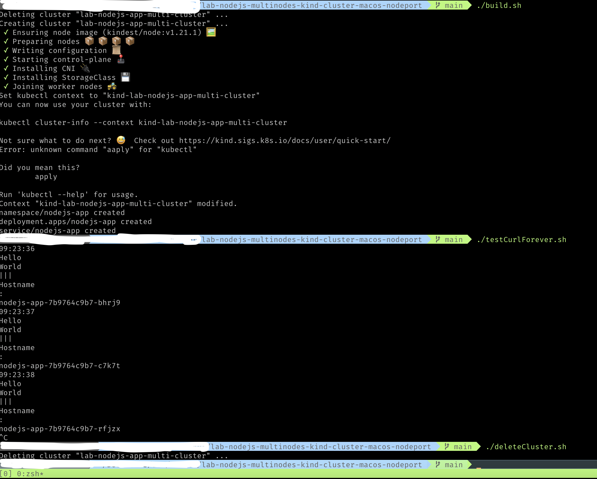

## A Simple Node Express Hello World Running on Kind k8s Cluster on MacOS

We will be runnin a docker image on a kuberneters cluster.
Cluster will be created by kind.

Issue here is that MacOS doesn't have support for nodeport with kind.
Which means that even if we run a nodeport service, we still can't reach
individual node using nodeip:nodeport

Also we can only reach one nodeport, which means that we can only reach one 
service in this cluster.

Follow this kind document: [extra-port-mappings](https://kind.sigs.k8s.io/docs/user/configuration#extra-port-mappings)


## Requirements
* MacOS
* Docker
* Kind

## Common setup Local with Docker

Clone the repo and install the dependencies.

```bash
git clone https://github.com/absunandan008/lab-nodejs-multinodes-kind-cluster-macos-nodeport.git
cd lab-nodejs-multinodes-kind-cluster-macos-nodeport
```
Make sure that you have docker running and kind installed

## Starting the cluster and deploying app

```bash
./build.sh
```
Once sluster is ready and app is deployed, you can test app with following command

## Testing app

This script runs forever and prints Hello World and hostname of node

```bash
./testCurlForever.sh
```
Interrupt this script and else it will keep on running

## Deleting cluster

```bash
./deleteCluster.sh
```
## How it all looks


